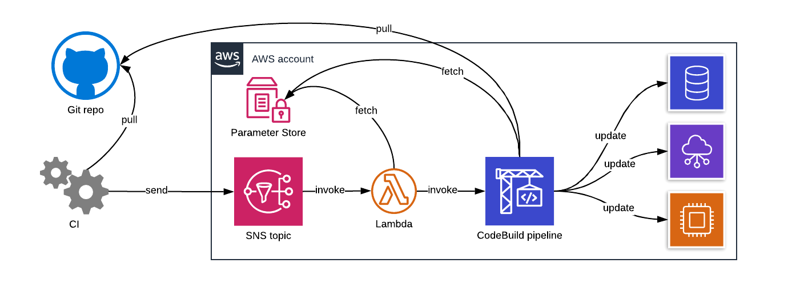

# iwomp-in-aws

> I Wanna Own My Pipeline In AWS.

A proof of concept for an AWS hosted Continuous Deployment pipeline that can be triggered from anywhere.



## Why?

Sometimes, you want to have your CI hosted on a 3rd party service (e.g. Travis), but you don't trust it enough to manage infrastructure for you.
That's where this project comes in handy:
You can run the deployment parts on AWS instead while granting the 3rd party CI only access to trigger the deployment.

## How does it work?

The pipeline consists of these components:

* **SSM parameters** for storing information on Git repositories that can be used with the pipeline.
* A small **Go program** to pull Git repos and execute scripts in them based on information gathered from the SSM parameters.
* A **CodeBuild project** that executes the Go program.
* A **SNS topic** where notifications for triggered jobs can be sent from outside AWS.
* A **Lambda function** that triggers the CodeBuild jobs based on incoming SNS topic notifications.

Here's how the flow works:

1. An SNS message is sent to the SNS topic with a JSON body that contains these fields:
    * `project`: the name of the project to trigger a pipeline job for
    * `branch`: Git branch to use in the pipeline job
2. Lambda picks up the message, ensures that the project is configured in SSM parameters, and triggers a CodeBuild job with the parameters from the SNS message.
3. CodeBuild job uses the Go program to fetch the project details from SSM, pull the Git repository based on the details, and run a configured deployment command.

Organising the flow like this means that we only need to grant the 3rd party CI access to send SNS messages to a single topic and nothing else.
There's no chance for the CI to inject arbitrary AWS API calls, if it were to go rogue.
That said, you still need to trust the contents of the Git repository.

## How do I install it?

This section describes how you can try the pipeline in AWS yourself.
By default, this will enable one deployable project:
[jkpl/cdk-demo](https://github.com/jkpl/cdk-demo/).
Feel free to customise any parts to your hearts pleasure.

**WARNING!** This will make changes to your AWS account, so make sure you understand what this project does before you use it.

### Pre-requisites

First, make sure you have these installed:

* [AWS CDK](https://aws.amazon.com/cdk/)
* [AWS CLI](https://aws.amazon.com/cli/)
* Either [Docker](https://www.docker.com/) or [Podman](https://podman.io/)

Second, make sure you have working AWS credentials and enough permissions to create the CDK stacks in the `infra/` directory.

### Install infrastructure

The pipeline is created using AWS CDK from the `infra/` repository.
There's a script in the `bin/` directory to get it deployed:

```
./bin/deploy_infra.sh
```

### Push the pipeline worker container image

The pipeline uses a custom container image from ECR.
You need to build and push it yourself.
There's a script in the `bin/` directory to do it:

```
./bin/deploy_image.sh
```

### Triggering a job

A job can be triggered by sending a JSON message to the created SNS topic.
The script `./bin/trigger_job.sh` can help with this.
Let's test it for our `demo` project:

```
./bin/trigger_job.sh demo master
```

You should see the results appear in the CodeBuild project created for the pipeline.

Normally, you would copy the `trigger_job.sh` script to any CI projects that you want to have triggering jobs in AWS.

## License

MIT License. See [LICENSE](LICENSE) for more information.
